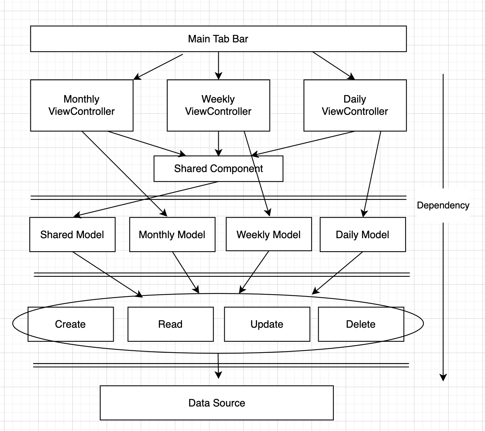

## 파일 구조 

&nbsp;&nbsp;&nbsp;&nbsp; 

<pre>
Planner App  
│
├── View
│   │    
│   ├── MainTabBarController 
│   ├── MonthlyViewController 
│   ├── WeeklyViewController
│   ├── DailyViewController             
│   └── SharedComponent 
│
├── Model
│   │
│   ├── SharedModel 
│   ├── MonthlyModel
│   ├── WeeklyModel
│   └── DailyModel     
│
├── CRUD 
│
└── Data 
     │ 
     └── DataSource
<pre>
